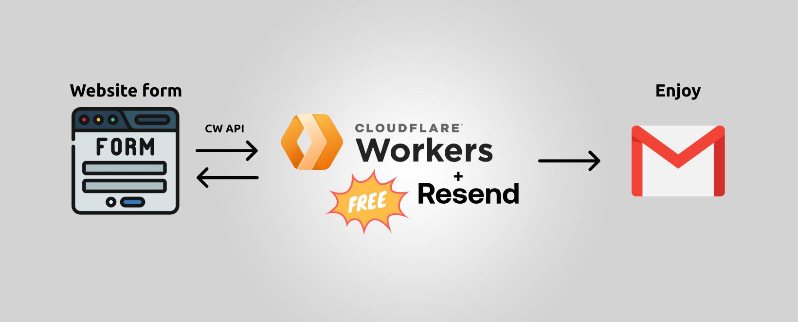

# Contact Form with Cloudflare Worker and Resend API

[Read post on Medium](https://medium.com/@yevheniimykhailichenko/819e4cf0baa7).

This repository contains a serverless function that processes contact form submissions. It validates the input data and sends an email via **Resend**, a fast and free service for sending emails.

With just a few lines of code, you can easily integrate this contact form into your website. There’s no need to build a backend from scratch—Resend handles email delivery for you.